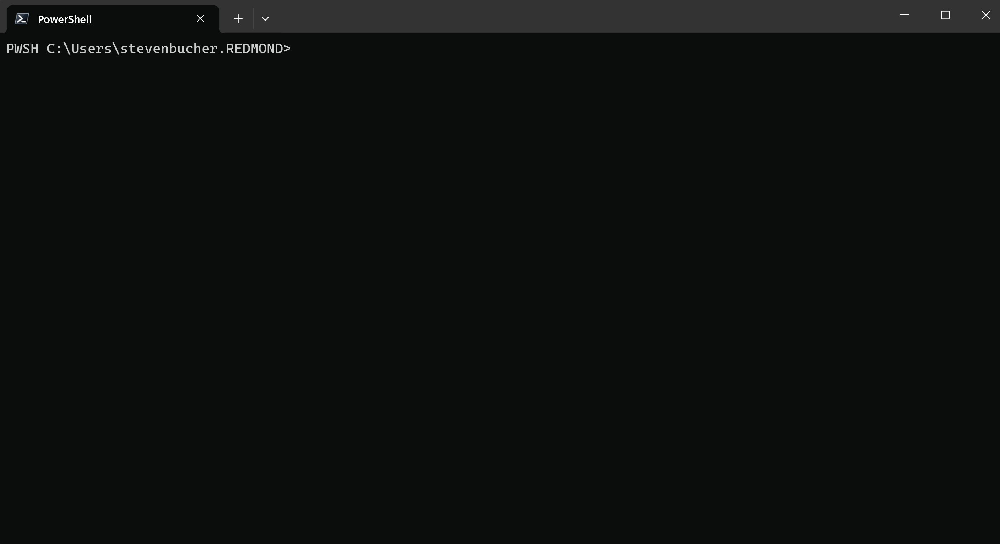

# Shell Copilot

This is a repository of various A.I + Shell prototypes we have created to test out experiences and
features. **Shell Copilot** is the latest and most finished prototype. It is a CLI tool that creates
an interactive chat session with a registered Large Language Model. Currently we are in a **Private Preview** state and everything is subject to change.



## Installing and Using Shell Copilot

Some prerequisites for building Shell Copilot
- Build script requires PowerShell v7.2 or newer versions. [PowerShell v7.4](https://learn.microsoft.com/powershell/scripting/install/installing-powershell?view=powershell-7.4) is recommended.
- [.NET SDK 8](https://dotnet.microsoft.com/en-us/download) is required to build the project.

Here are the steps to install and use Shell Copilot.
1. Clone this repository, `git clone https://github.com/PowerShell/ShellCopilot`;
2. Run `./build.ps1` in the repository's root directory to build the project;
3. After the build is complete, you can find the produced executable `aish` in the `out\debug` folder within the repository's root directory. You can add it to the `PATH` environment variable for easy access.

> Note: Depending on your OS directory paths may be `\` on Windows or `/` on Mac.

## Agent Concept

Shell Copilot has a concept of different A.I Agents, these can be thought of like modules that users can use to interact with different A.I models. Right now there are two supported agents
- `az-cli`
- `openai-gpt`

If you run `aish` you will get prompted to choose between the two.

### Az-CLI Agent

This agent is for talking specifically to an Az CLI endpoint tailored to helping users with Azure CLI questions.

Prerequisites:
- Have [Azure CLI installed](https://learn.microsoft.com/cli/azure/install-azure-cli)
- Login with an Azure account within the Microsoft tenant with `az login` command

### OpenAI-GPT Agent

This is a more generalized agent that users can bring their own instance of Azure OpenAI (or the public OpenAI) and a completely customizable system prompt.
Right now, it is defaulted to an internal Azure OpenAI endpoint with a prompt to be an assistant for PowerShell commands. This is for internal private preview purposes only.

## Getting an Azure OpenAI Endpoint Key

All the configuration is already included by default and on the first run of this agent you will be prompted to include a API key to be able to use this endpoint.

Guide for Signing Up For API Key
1.  Navigate to <https://pscopilot.developer.azure-api.net>
2.  Click `Sign Up` located on the top right corner of the page.
3.  Sign up for a subscription by filling in the fields (email, password, first name, last name).
4.  Verify the account (An email should have been sent from
    <apimgmt-noreply@mail.windowsazure.com> to your email)
5.  Click `Sign In` located on the top right corner of the page.
6.  Enter the email and password used when signing up.
7.  Click `Products` located on the top right corner of the page
8.  In the field stating `Your new product subscription name`, Enter `Azure OpenAI Service API`.
9.  Click `Subscribe` to be subscribed to the product.

In order to view your subscription/API key,
1.  Click `Profile` located on the top right corner of the page.
2.  Your Key should be located under the `Subscriptions` section. Click on `Show` to view the
    primary or secondary key.

Once you have a key you can always edit your endpoint configuration by running `/agent config openai-gpt` within Shell Copilot. This opens up a JSON file with all the configuration options. 

If you have separate Azure OpenAI endpoint you can use that instead of the one above. Read more at
[Create and deploy an Azure OpenAI Service resource](https://learn.microsoft.com/en-us/azure/ai-services/openai/how-to/create-resource?pivots=ps).

## Using Shell Copilot

To start a chat session with the LLM, simply run `aish` and it will open up a new session in your current window. We suggest using a split pane approach with the terminal of choice, Windows Terminal offers an easy pane option by running:

```shell
wt -w 0 sp aish
```

To explore the other options available to you, run `aish --help` to see all the subcommands. 

If you would like to tie this command to a key like `F3` you can add the following code to your `$PROFILE`:

```powershell
Set-PSReadLineKeyHandler -Chord F3 -ScriptBlock { wt -w 0 sp --tabColor '#345beb'--size 0.4 -p "{574e775e-4f2a-5b96-ac1e-a2962a402336}" --title 'Shell Copilot' <FULL PATH TO aish.exe> }
```

## Feedback

We still in development and value any and all feedback! Please file an [issue in this repository](https://github.com/PowerShell/ShellCopilot/issues) for
any bugs, suggestions and feedback. Any additional feedback can be sent to
stevenbucher@microsoft.com.
