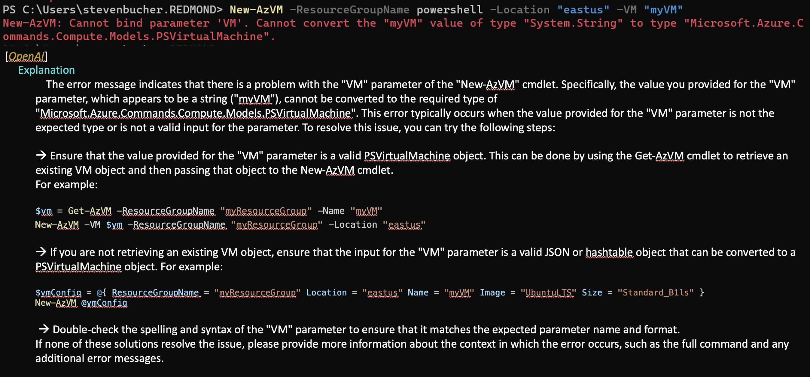

# AI CLI Scenarios

This document outlines the different scenarios in a CLI experience that would benefit from
Artificial Intelligence (AI) assistance and more tailored prompt engineering.

## User Story

As a PowerShell developer, I want to have an AI-enhanced CLI experience that can understand my
intent, provide relevant suggestions, and improve my productivity.

## Current Experience

The current CLI experience lacks AI assistance, leaving users to rely on their own knowledge and
expertise when interacting with PowerShell commands. This can result in a steep learning curve,
especially for new users, and reduced productivity for experienced users.

## Enhanced Experience

An AI-enhanced CLI experience will provide users with intelligent suggestions, automatic command
completion, and natural language understanding for a more intuitive and efficient interaction with
PowerShell commands. The purpose of this document is to outline a number of these scenarios to
understand what requirements each may have from an engineering and design perspective. To keep
consistent with some of the **IntelligentShell** solution areas, we will include each scenarios
category. For reference the four areas are:
1. Shell Assistance
2. Error Recovery
3. Error Prevention
4. Roaming Profile

### Scenario 1: Intelligent Suggestions

The AI-enhanced CLI will analyze the user's input and provide relevant suggestions based on their
command history, context, and available commands. This will help users discover new commands and
options, as well as reduce the need to memorize or look up command syntax.

- Example pre-execution:

```powershell
Get-ChildItem -<TAB>
```

The AI-enhanced CLI will provide suggestions for available parameters and values, such as `-Path`, `-Filter`, and `-Recurse`. This falls under the **Shell Assitant** bucket.

- Example post-execution:

```powershell
# TODO: create a better example
PS> uname
Darwin

[JSON Adapter]
  The most similar commands are:
    ➤ uname | uname-json | ConvertFrom-JSON
    ➤ uname | jc --uname | ConvertFrom-JSON
```

The AI-enhanced CLI will provide suggestions for available parameters and values, such as `-Path`, `-Filter`, and `-Recurse`. This falls under the **Shell Assitant** bucket.

### Scenario 2: Automatic Command Completion

The AI-enhanced CLI will automatically complete commands and parameters based on the user's input
and context. This will help users save time and reduce the likelihood of errors due to incorrect
syntax. 

Example:

```powershell
Get-Process | Stop-<TAB>
```

The AI-enhanced CLI will automatically complete the command as `Stop-Process`. This falls under the **Shell Assitant** bucket.

### Scenario 3: Natural Language Understanding

The AI-enhanced CLI will understand natural language input and translate it into PowerShell
commands. This will enable users to interact with PowerShell using more intuitive and human-like
language, rather than having to learn and use specific command syntax. 

Example:

```powershell
> "Show me all files in the current directory"
```

The AI-enhanced CLI will translate the natural language input into the appropriate PowerShell
command, such as `Get-ChildItem`. This is similar to the current prototype experience for asking
question in an alternate screen buffer. A future approach could be executing _purely_ based off of
natural language input, however I believe this expeirence is far in the future. This falls under the
**Shell Assitant** bucket.

### Scenario 4: Natural Langauge Error Explanation and Recovery

The AI enhanced CLI will get the error message that just occured in the shell and then provide a better natural language explanation of what happened and provide remediation steps if possible.

Example (PowerShell specific):


The AI-enhanced CLI will translate the error into more digestable wording and provide potential
error recovery steps to give the user remediation cmds to run. This falls under the **Error
Recovery** bucket.

### Scenario 5: Error prevention indications

The AI-enhanced CLI will be able to assist the user by attempting to prevent error

```powershell
# Commands not found on the system could be identified and highlighted
Get-Cntent -Path ~/myfile.txt #(the typo to the left is underlined)
```

### Scenario 6: Roaming Profile

The AI-enhanced CLI will be able to keep customizable data from sources like their `$PROFILE`, `powershell.config.json`, or history files across the different platforms and environments they use.

```powershell
# Local Shell
>Get-ChildItem -Filter *.ps1

# In a different shell registered with the AI-enhanced CLI and PSReadLine Listview enabled
>PS /Users/stevenbucher> Get-                        
> Get-ChildItem -Filter *.ps1                                         [History]
```

## Requirements Table

| Requirement | Description | Priority |
| --- | --- | --- |
| 1. Intelligent Suggestions | Implement AI-powered suggestions for commands and parameters based on user input and context. | 0 |
| 2. Automatic Command Completion | Enable AI-powered automatic command completion based on user input and context. | 0 |
| 3. Natural Language Understanding | Implement AI-powered natural language understanding for translating user input into PowerShell commands. | 0 |
| 4. Natural Langauge Error Explanation and Recovery | Enable AI-powered automatic error explanation and recovery steps | 0 |
| 5. Error prevention indications | Incorporate some kind of pre-execution indication of an error that will occur | 1 |
| 6. Roaming Profile | User is able to keep customizable portions of the CLI experience across environments. | 2 |
| 7. Model Extensibility | Ensure the user can utilize their own models. | 2 |
| 8. Performance | Optimize AI performance to minimize latency and ensure a seamless user experience. | 1 |
| 9. Privacy | Ensure that user data and command history is securely stored and processed, adhering to privacy regulations and best practices. | 0 |
