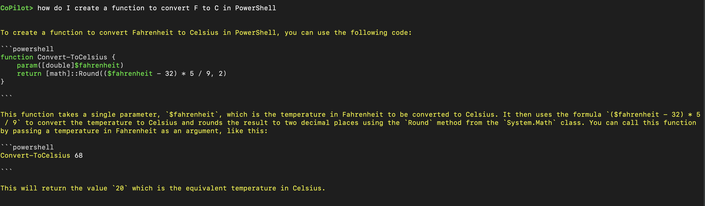

# Prompting Scenarios

This document outlines a number of different scenarios of activies users do in the CLI that can be
done with an executable tool. These scenarios or features of the AzCopilot tool would require
specific prompting for calls to the off box A.I model in order to give better results.

## Errors
____

**Problem**: CLI user runs into an error of somekind in the CLI.

**Solution**: Run command/subcommand from executable to ask how to fix it.

Example: 

```powershell
PS /Users/stevenbucher> 1/0                    
RuntimeException: Attempted to divide by zero.
PS /Users/stevenbucher> wtf
The error message indicates that there was an attempted division by zero, which is not a valid operation in mathematics. In this case, the command `1/0` was executed, leading to the error. To resolve this, you should avoid dividing by zero in your calculations. If you are writing a script that performs calculations, you may want to add code to check for and handle division by zero errors before executing the operation.
```

| Response Requirement         | Priority     | 
|----------------------|--------------|
| Give a detailed explanation of what error has occured | P0     | 
| When confident of its success, return code that can be helpful to resolving the error      |  P0 |

## Natural Language to Code 
____
**Problem**: CLI user is unsure how to complete a task.

**Solution**: Ask a question in a natural langauge format to get potential solutions to complete said task from an A.I Model. 

Example:




| Requirements         | Priority     | 
|----------------------|--------------|
| Return releveant natural language response | P0 |
| Return code when confident the code can be helpful to the questions | P0 |
| Ensure sources are cited when giving back a response | P1 |

## "What to do next" 
_____
**Problem**: CLI user has completed portions of a multi-step task but is unsure what to do next in the sequence.

**Solution**: After completing portions of the task, user can ask what to do next to get next steps.

This scenario utilizes the users current **session history** to give the model more context into what
the user is trying to do. This is a user opted in scenario for sharing context to the model for more
refined results. Given there are many multi-line steps to complete CLI based tasks, especially with
cloud services, the model will benefit to having more context to what the user is trying to do to
reduce the need for asking multiple questions to a large langauge model.

Example:
```powershell
>New-AzResourceGroup `
   -ResourceGroupName "mySpecificResourceGroup" `
   -Location "EastUS"
>$cred = Get-Credential
>New-AzVm `
    -ResourceGroupName "mySpecificResourceGroup" `
    -Name "myVM" `
    -Location "EastUS" `
    -VirtualNetworkName "myVnet" `
    -SubnetName "mySubnet" `
    -SecurityGroupName "myNetworkSecurityGroup" `
    -PublicIpAddressName "myPublicIpAddress" `
    -Credential $cred
> What-Next
I see you have recently deployed a new VM named `myVM`. You can connect to it by first getting the IP of the resource group
``powershell
Get-AzPublicIpAddress `
   -ResourceGroupName "mySpecificResourceGroup"  | Select IpAddress
``
You can then the Microsoft Terminal Services Client to connect via the publicIPAddress of your VM.
``powershell
mstsc /v:<publicIPAddress>
``
Source: https://learn.microsoft.com/en-us/azure/virtual-machines/windows/tutorial-manage-vm#connect-to-vm
```
Notice how the model can autofill specific details like
`-ResourceGroupName "mySpecificResourceGroup"` but won't fill out things that it does not know from
the users context. This tool would send the previous lines in the session with a prompt to the large
language model to give it the necessary context.

## Summarize and Explain
_____
**Problem**: A CLI user has a file with contents they are unsure what it does or not.

**Solution**: Ask a large language model to inspect a particular file and summarize it in a natural language concise way. 


## Analyze and Improve 
_____
**Problem**: A CLI user has a script or code file that they are unsure if it is properly optimized or efficient.

**Solution**: Ask a large language model to inspect a particular coding file and improve it in some specified way. 

Some examples of "improvement" could be in regards to preformance, writing comments or reducing line numbers. 

Example in bash:
```
>azcopilot inspect test.py --preformance
We noticed in your file you are doing the following for cacluate square numbers:
``python
square_numbers = []
  for n in range(0,10):
    if n % 2 == 1:
      square_numbers.append(n**2)
``
To speed up your process you can use list comprehension to speed up your code like so:

``python
square_numbers = [n**2 for n in range(1,10) if n%2 == 1]
``
```
Example in PowerShell:
>Analyze-Code -Path ./test.ps1 -Document

## Script Builder 
- similiar to function builder for PowerShellAI but not exclusive to functions.
## Generative Notebook

 experience - like the current web ChatGPT version however you can run the commands inline and get the results or edit it in real time

## Custom Prompting
Setting particular session with custom prompts/roles (New-Chat in PowerShellAI) 


- think about timeout
- Take other stuff from UI


https://github.com/toolleeo/cli-apps/tree/master