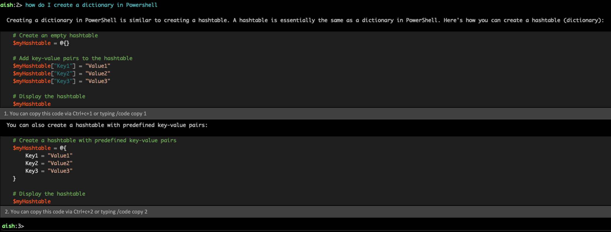
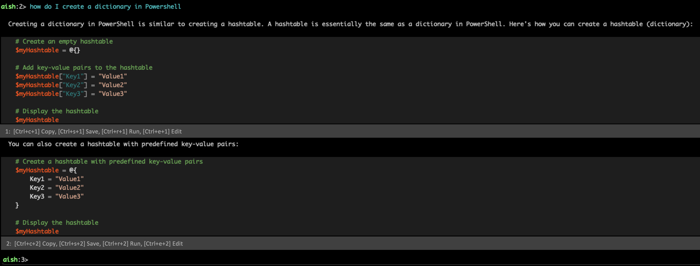

# ShellCopilot Shell Interactions

To differentiate from other CLI copilots, we need to add more value to the user so that they can
better use this tool as a copilot for the shell rather than a copilot in the shell. In other words,
we need to add ways to interact with the shell in a better way such that we are not a simple LLM
wrapper in the shell with limited and difficult capabilities.

On thing to note is that this is different than Shell **integration** which is deeper integration
with the shell while this one pager focuses on what capabilities users should have to interact with
the input and output of LLMs.

We hypothesize that in the far far future, users can be able to use A.I to use natural language as
the new language for doing work on a computer. Although this may be an ambitious idea, if we can
give enough capabilities for users to _stay_ in the interactive chat session of ShellCopilot and be
able to get all their work done, that is an indicator of such a hypothesis being correct. In some
ways it can be thought of as a Jupiter Notebook-esc experience in the shell.

## Goals
- Enable common shell interactions in the interactive chat of Shell Copilot
- Enable common non-interactive scenarios for Shell Copilot
- Give users enough capabilities for them to get all the work they need done in the interactive chat
  session of Shell Copilot
- Create an effective user experince that allows for users to interact with LLMs _without taking their hands off the keyboard_

## Interactions/Scenarios

### Copying Code

Copying and pasting code is a pretty simple example of a good shell interaction. Users should be
able to use typical hotkeys and highlighting to copy and paste code responses from the LLM. Since responses may be giving more than one code block response, we need a way for users to choose
which one to copy via hotkey or command. This can be done by indexing each code block and then using the index to copy the code block, i.e first code block can be copied by `Ctrl+c+1` and second code block can be copied by `Ctrl+c+2` and so on.

Additionally since we also support commands run in the interactive chat, we can indicate which code
block to copy via a parameter for indicating which one to copy.

```
aish:2>/code copy 1
Code snippet 1 copied to clipboard.
aish:2>/code copy 2
Code snippet 2 copied to clipboard.
```

Requirements:
- Based on platform allow users to use their typical `Ctrl+c` and `Cmd+c` hotkey to copy code if a single code block is given.
- Give users ability to specify which code block to copy via adding index of code block to typical hotkey. For example `Ctrl+c+1` would copy the first code block.
- Add command in interactive chat to copy code block to clipboard. For example `/code copy 1` would copy the first code block and just `/code copy` would copy the first code block if only one code block is given.

### Command History

The input prompt for the interactive chat session should have history of the commands ran. Other
interactions with history include historical predictive intellisense, up arrow key capabilities and
recursive search; all capabilities familiar with any shell user.

Requirements:
- Allow users to use up arrow key to navigate history
- Utilize same history predictive intellisense as expected in PSReadLine
- (OPTIONAL) Include predictive prompts from common LLMs prompts and follow up prompts after particular prompt. 

### File I/O

Interacting with files is a common task of normal shells, for ShellCopilot we should be able to give
users that same connection of files and the interactive chat experience. This means giving users
ability to input file contents as part of the prompt and saving results from the LLM to the file.
This should be done in both interactive and non-interactive modes of the tool.

Non-interactive:
```
PS>cat file.py | aish "explain what this file is doing"
```
Requirements:
- Allow users to use stdin as input for files
- Allow users to be able to save output via stdout to files

Interactive:

If we are to treat the `aish` interactive chat similar to a normal shell, we need to give it a level
of **directory awareness** so it can interact with the files in an easier natural language way. For
example

```powershell
PS>Get-ChildItem
    Directory: /Users/stevenbucher/Documents/Testing/adapters

UnixMode   User             Group                 LastWriteTime           Size Name
--------   ----             -----                 -------------           ---- ----
-rw-r--r-- stevenbucher     staff               8/28/2023 10:21             53 df-adapter.ps1
-rw-r--r-- stevenbucher     staff               6/26/2023 10:22             38 uname-adapter.ps1
-rw-r--r-- stevenbucher     staff               9/29/2023 09:05            939 vm_stat-adapter.ps1

PS>aish

Shell Copilot (v0.1)
Using the model testendpoint:

  Endpoint :    https://pscopilot.azure-api.net
  Deployment :  gpt4

Type  /help  for instructions.
aish:1>Can you translate these files to python versions of them?
```
> Note for discussion: does it make sense for directory navigation to happen in this shell? Meaning we can `cd` and `ls` work as expected in normal shell?

Additionally supporting hotkey and commands will be helpful for keeping consistency with other forms of interactions. 

Requirements:
- Make the interactive chat directory aware of users current directory
- Allow users to specify files in their current directory as input for LLMs
- Allow users to use hotkey for saving specified code block to file
  - For single code block, `Ctrl+s` would save the code block to a file and prompt user the name of the file
  - For multiple code blocks, `Ctrl+s+<index #>` would save the code block to a file and prompt user the name of the file
- Allow users to use command for saving specified code block to file
  - For single code block, `/code save <filename>` would save the code block to a file
  - For multiple code blocks, `/code save <index #> <filename>` would save the specified code block
    to a file

### Executing Response Code 

The quick "one-line" nature of many CLI commands means that users will likely want quick ways to
execute simple commands given my the LLMs. Copying the response from the LLM, exiting `aish` and
then pasting and executing the command is arguably a worse experience than chatting with LLMs in the
web browser and coping and pasting from there. 

```console
aish:1>How do I list files in my home directory?
To list files in your home directory using PowerShell, you can use the  Get-ChildItem  cmdlet. Here's the code you need to run:

    Get-ChildItem -Path $HOME
    
Would you like to execute this command? [y/n]
```

For large responses that give more than one code block response, we can use similar method to
copying and pasting multiple blocks to create hotkeys and commands to run particular code blocks.

```console
aish:1> how do I create a file in powershell

  You can create a new file in PowerShell using the  New-Item  cmdlet. Here's an example:

    New-Item -Path "C:\path\to\your\file.txt" -ItemType File
1:  [Ctrl+c+1] Copy, [Ctrl+r+1] Run,

  Replace  C:\path\to\your\file.txt  with the path where you want to create the new file. This command will create a new empty file with the specified name and location.
aish:2>/code run 1
```

Requirements:
- For short single line commands, prompt for the user to consent to the command being run 
- Have output of command be returned to the interactive chat
- For longer commands, 
  - Support hotkey scenario
    - For single code block, `Ctrl+r` would run the first and only code block.
    - For multiple code blocks, `Ctrl+r+<index #>` would run the specified code block.
  - Support command scenario
    - For single code block, `/code run` would run the first and only code block.
    - For multiple code blocks, `/code run <index #>` would run the specified code block.
- Have the LLM prompt be aware of the output of commands ran in the interactive session for good context 

### Editing Code 

For larger code responses, it makes sense for the users to want to open or edit further in a
dedicated text editor rather than the shell. Using the same pattern we use for copying and running,
we can add hotkey and commands to open in an editor.

#### 3rd Party Editor

Since users may feel most comfortable with their own editor, we should allow them to open up LLM
resulted code in specified editors.

```console
aish1:>/code edit 1
Specify editor you want to use [code, vim, nano, emacs, notepad, etc]: code
<opens in vscode>
```

> Note for discussion: Which editor do we open? Do we have a default? Do we have a way to configure which editor is opened up?

Requirements:
- Allow users to open up code results in editor which editor to open code in via hotkey, `Ctrl+e`
  for single code block results and `Ctrl+e+<index #>` for multiple code block results. They would
  be prompted for which editor to use.
- Allow users to specify which editor to open code in via command, `/code edit --editor code` for
  single code block results and `/code edit 1 --editor code` for multiple code block results.
- With either hotkey or command open up specified editor with code block already inserted and unsaved

#### In Chat Editor
For an easier user experience it may make sense to allow users to edit code in the interactive chat
instead of switching context to a different code editor. When users would hit the hotkey or command
to edit code, we can open up a cli code editor in their shell with the code block already inserted.

Requirements:
- Open up shell editor with code block already inserted and unsaved
- Allow users to exit the editor and return back to their interactive chat session

### Redirection

For non-interactive scenarios, it may make sense to support some basic kind of redirection.

This example would save the whole output of the LLM to a file.
```powershell
PS>cat file.py | aish "explain what this file is doing" > output.txt
```

It also may make sense to add a specific channel to only take the code output from an LLM response
to save to a file. For sake of example consider it like a different standard stream indicated by the
`3` as to not clobber existing streams.

```powershell
PS>aish "write me a helloworld.ps1" 3> helloworld.ps1
PS>cat helloworld.ps1
Write-Output "Hello World"
```

## Appendix

### Mockups






### Hotkeys and Commands 

| Hotkey | Description |
| --- | --- |
| `Ctrl+c` | Copies the first code block |
| `Ctrl+c+<index>` | Copies the code block with the specified index |
| `Ctrl+s` | Saves the first code block to a file |
| `Ctrl+s+<index>` | Saves the code block with the specified index to a file |
| `Ctrl+r` | Runs the first code block |
| `Ctrl+r+<index>` | Runs the code block with the specified index |
| `Ctrl+e` | Opens the first code block in the in shell editor |
| `Ctrl+e+<index>` | Opens the code block with the specified index in the in shell editor|

| Command | Description |
| --- | --- |
| `/code copy` | Copies the first/only code block |
| `/code copy <index>` | Copies the code block with the specified index |
| `/code save <filename>` | Saves the first/only code block to the specified file |
| `/code save <index> <filename>` | Saves the code block with the specified index to the specified file |
| `/code run` | Runs the first/only code block |
| `/code run <index>` | Runs the code block with the specified index |
| `/code edit` | Opens the first/only code block in the in shell editor |
| `/code edit <index>` | Opens the code block with the specified index in the in shell editor |
| `/code edit <index> --editor <editor>` | Opens the code block with the specified index in the specified editor |

TODO: add demo.txt for non-interactive scenarios