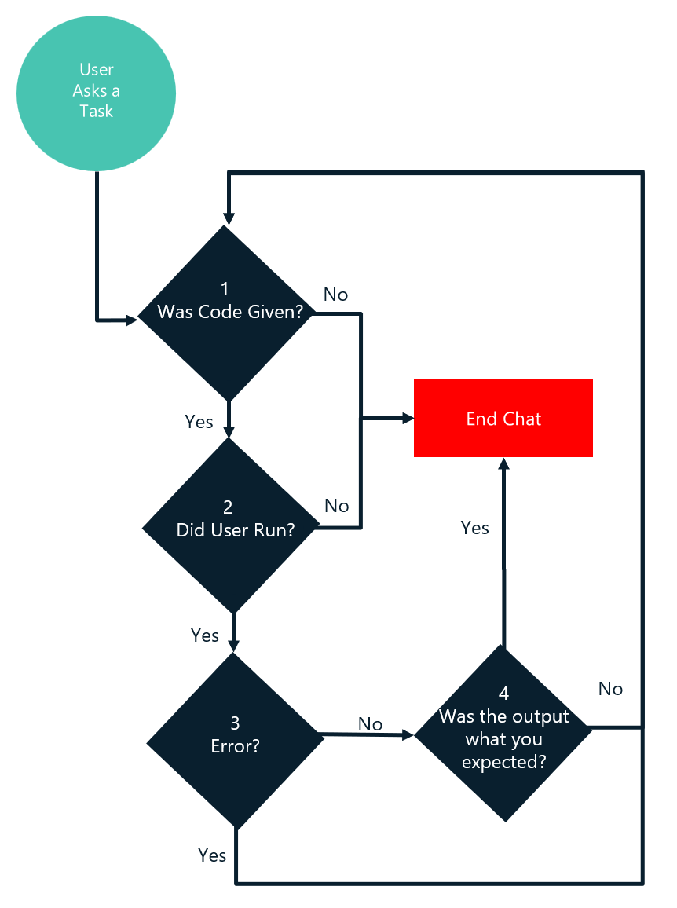

# Interpreter Agent

![GIF showing demo of Interpreter Agent][01]

## Description

This is an agent that specializes in completing code related tasks.
This agent will take a user's task to be done, write a plan, generate code, execute code,
and move on to the next step of the plan until the task is complete while correcting itself for any errors.
It currently only supports generating and running PowerShell or Python code.

## Table of Contents

- [Usage][02]
- [Prerequisites][03]
- [Configuration][04]
- [Architecture][05]
- [Known limitations][06]

## Usage

1. Enter a task in natural language and the agent will generate code to complete the task.
   We have only tested using English but may work with other languages.
1. Type `'y'` and press enter or just press enter (prompt defaults to `'y'`) to run the generated code.
   Auto execution is configurable in the settings file, where the agent will run the code without user confirmation.
1. Sit back and watch the agent do the work.

## Prerequisites

- Install Python and PowerShell 7. Make sure they are added to the `PATH` environment variable.
- Configure the AI service to use in the setting file
  - For OpenAI, you need the **Model Name** and **API Key**. Docs: [OpenAI Model][10], [OpenAI API Key][09].
  - For Azure OpenAI Service, you need the **Endpoint**, **Deployment Name**, **Model Name**, and **API Key**. Docs: [Access to Azure OpenAI][07], [Create an Azure OpenAI deployment][08].

## Configuration

To configure the agent, run `/agent config interpreter` to open up the setting file in your default editor,
and then update the file based on the following example.

```jsonc
{
  // To use the Azure OpenAI service:
  // - Set `Endpoint` to the endpoint of your Azure OpenAI service,
  //     or the endpoint to the Azure API Management service if you are using it as a gateway.
  // - Set `Deployment` to the deployment name of your Azure OpenAI service.
  // - Set `ModelName` to the name of the model used for your deployment, e.g. "gpt-4-0613".
  // - Set `Key` to the access key of your Azure OpenAI service,
  //     or the key of the Azure API Management service if you are using it as a gateway.
  "Endpoint" : "<insert your Azure OpenAI endpoint>",
  "Deployment" : "<insert your deployment name>",
  "ModelName" : "<insert the model name>",
  "Key" : "<insert your key>",
  "AutoExecution" : false, // 'true' to allow the agent run code automatically; 'false' to always prompt before running code.
  "DisplayErrors" : true   // 'true' to display the errors when running code; 'false' to hide the errors to be less verbose.

  // To use the public OpenAI service:
  // - Ignore the `Endpoint` and `Deployment` keys.
  // - Set `ModelName` to the name of the model to be used. e.g. "gpt-4o".
  // - Set `Key` to be the OpenAI access token.
  // Replace the above with the following:
  /*
  "ModelName": "<insert the model name>",
  "Key": "<insert your key>",
  "AutoExecution": false,
  "DisplayErrors": true
  */
}
```

## Architecture

The architecture of this agent is depicted in the diagram below.

1. The agent is initialized using the `interpreter.agent.json` file.
1. The model type (function calling or text based) is determined based on the setting.
1. `TaskCompletionChat` is the main loop of the program, where a user query is processed.
   - If the AI response does not contain a function call/code, the main program loop is terminated.
   - If the AI response contains a function call/code, the code gets executed upon user's approval.
1. Code output is displayed, collected, and returned to the AI.
1. If any errors is detected when running the code, the agent attempts to correct them and re-rerun code.
1. The main loop continues until task is complete or more information is needed.


### Execution Flow

The execution flow of this agent is depicted in the diagram below.



## Known limitations

- AI generated code still may produce incorrect code and responses.
- Agent may produce hallucinations for code results if there is no output to verify the code.
- Chat history is reduced to git token limits per model.
  When chat is too long, agent will lose context of earliest results.
- Agent can't handle concurrent tasks.

<!-- link references -->
[01]: ./assets/InterpreterAgentDemoSpedUp.gif
[02]: #usage
[03]: #prerequisites
[04]: #configuration
[05]: #architecture
[06]: #known-limitations
[07]: https://aka.ms/oai/access?azure-portal=true
[08]: https://learn.microsoft.com/azure/ai-services/openai/how-to/create-resource?pivots=web-portal
[09]: https://platform.openai.com/api-keys
[10]: https://platform.openai.com/docs/models
